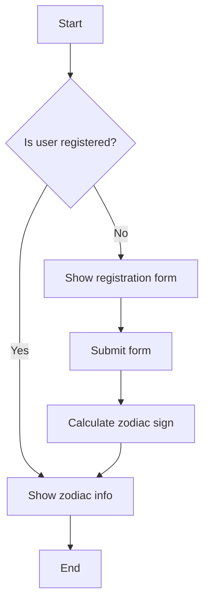

# Sample Flowchart

```mermaid
flowchart TD
    A[Start] --> B{Is user registered?}
    B -->|Yes| C[Show zodiac info]
    B -->|No| D[Show registration form]
    D --> E[Submit form]
    E --> F[Calculate zodiac sign]
    F --> C
    C --> G[End]
```

This flowchart shows the basic flow of our zodiac application.
